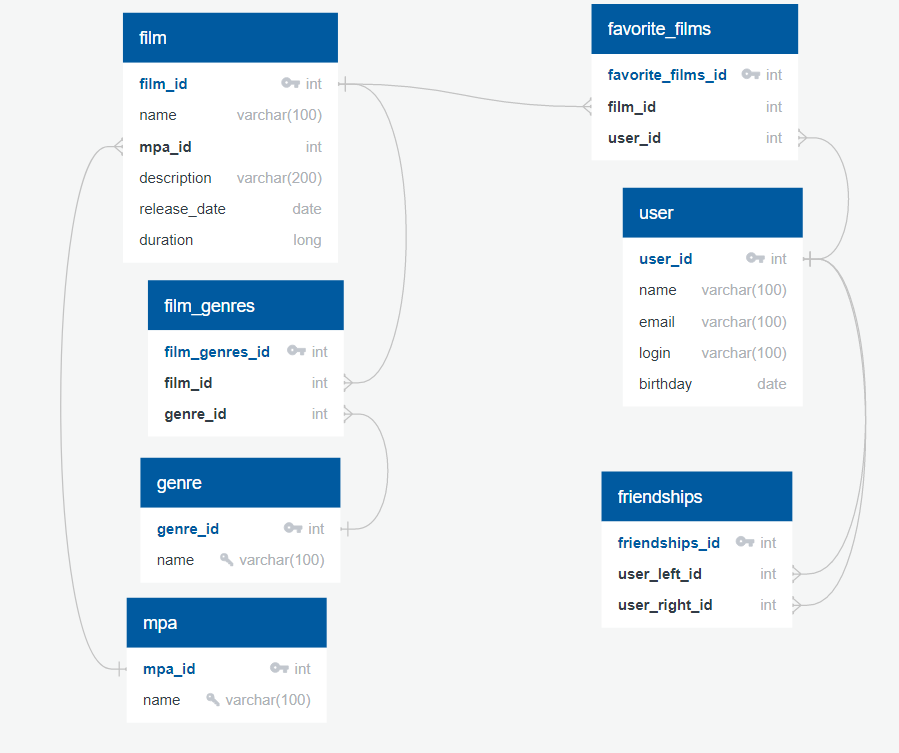

# java-filmorate

### Схема бызы данных для Filmorate project.


### Примеры запросов для основных операций приложения

1. Пример запроса для получения списка всех фильмов
```
SELECT f.*, m.mpa_id, m.name AS mpa_name FROM film AS f LEFT JOIN mpa AS m ON f.mpa_id = m.mpa_id
```

1. Пример запроса для получения топ N наиболее популярных фильмов
```
SELECT f.*, m.mpa_id, m.name AS mpa_name, COUNT(DISTINCT(ff.user_id)) AS likes FROM film AS f 
LEFT JOIN mpa AS m ON f.mpa_id = m.mpa_id 
LEFT JOIN favorite_films AS ff ON f.film_id = ff.film_id 
GROUP BY f.FILM_ID 
ORDER BY likes DESC 
LIMIT N OFFSET 0"
```

1. Пример запроса для получения списка друзей пользователя где {ID} это идентификатор пользователя, здесь "is_friend" признак указывающий на то принята ли дружба
```
SELECT fu.*, COUNT(fsr.friendships_id) > 0 AS is_friend FROM film_user AS fu 
JOIN friendships AS fs ON fs.user_left_id = {ID} AND fu.user_id = fs.user_right_id 
LEFT JOIN friendships AS fsr ON fsr.user_right_id = fs.user_left_id AND fsr.user_left_id = fs.user_right_id 
GROUP BY fu.user_id 
ORDER BY fu.user_id
```

1. Пример запроса для получения списка общих друзей пользователей где {ID_1} {ID_2} это идентификаторы пользователей, здесь "is_friend" признак указывающий на то принята ли дружба пользователем с {ID_1}
```
SELECT fu.*, COUNT(fsr.friendships_id) > 0 AS is_friend FROM film_user AS fu 
JOIN friendships AS fs ON fs.user_left_id = {ID_1} AND fu.user_id = fs.user_right_id 
LEFT JOIN friendships AS fsr ON fsr.user_right_id = fs.user_left_id AND fsr.user_left_id = fs.user_right_id 
JOIN friendships AS fso ON fso.user_left_id = {ID_2} AND fu.user_id = fso.user_right_id 
GROUP BY fu.user_id 
ORDER BY fu.user_id
```